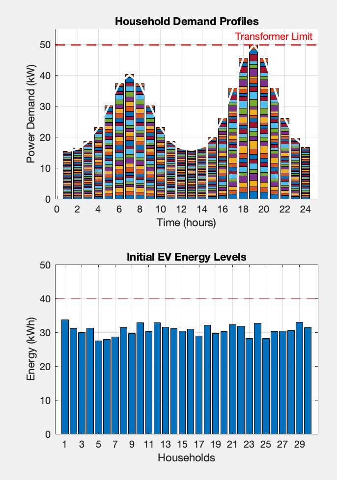
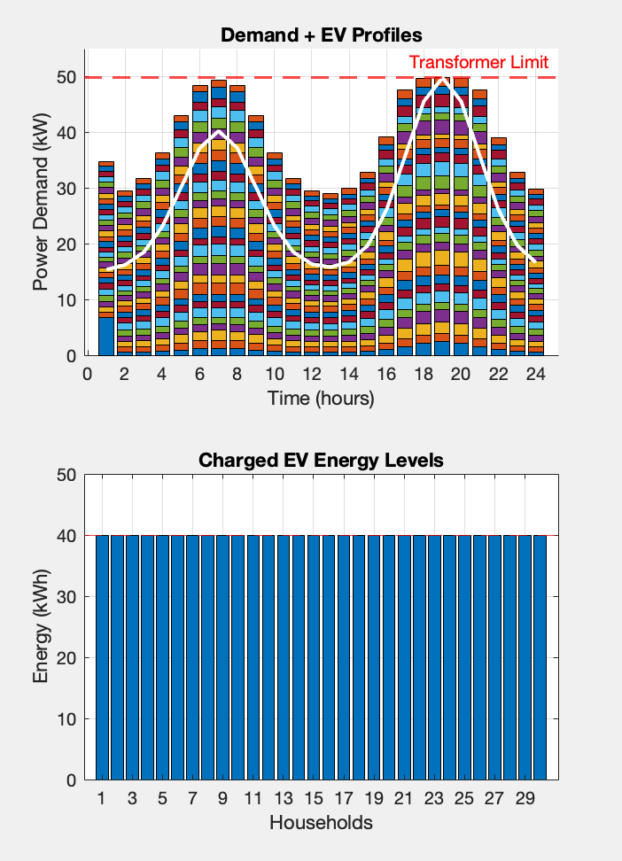
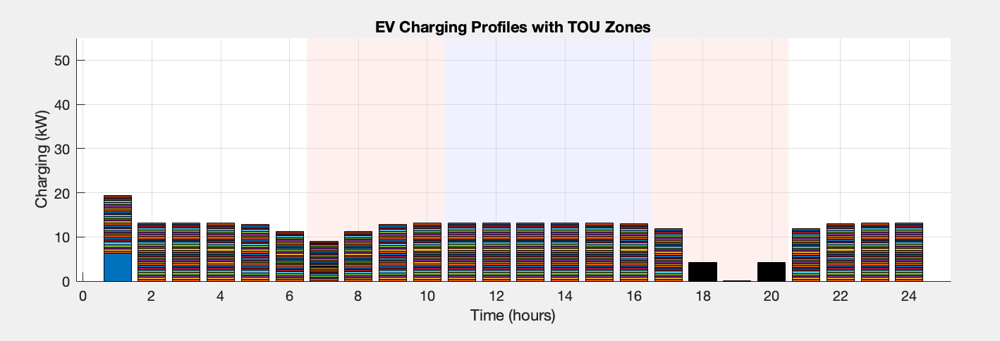

# Host Capacity Management via Single-Level Reformulation of a Bilevel EV Charging Problem

This project explores Host Capacity Management by transforming a bilevel optimization problem into a single-level optimization problem. The original formulation considers an upper-level decision maker managing transformer capacity and a lower-level model representing the flexible charging behavior of electric vehicle (EV) users. The bilevel model is reformulated into a single-level problem using Karush-Kuhn-Tucker (KKT) conditions.

## Problem Overview

With increasing penetration of Electric Vehicles (EVs), distribution transformers face potential thermal overload risks. This project tackles the problem of scheduling EV charging in a way that:
	•	Respects transformer thermal capacity limits (Upper Level),
	•	Allows flexible EV charging while satisfying household energy demand (Lower Level).

The lower-level decisions (EV charging behavior) are incorporated into the upper-level problem via KKT conditions, enabling efficient and tractable solution as a single-level nonlinear optimization problem.

## Code Overview
	•	MATLAB – Used for preprocessing, postprocessing, and invoking the AMPL API (via accessay.m).
	•	AMPL (A Mathematical Programming Language) – Used to model and solve the optimization problem (file: kkt_modified.mod).

## Problem Formulation

### Upper-Level (Grid Operator / Transformer Host):
	•	Objective: Ensure that total power demand from all consumers does not exceed transformer thermal limit.
	•	Decision Variable: Maximun Power Draw limit for each household.

### Lower-Level (Individual Households):
	•	Model: Each household has:
	•	Inflexible load (e.g. lighting, appliances),
	•	Flexible EV charging with no power export and no on-site generation (e.g. PV),
	•	EVs can only import energy for charging,
  •	Time of Use Tariff Applied
	•	Minimise Electricity Cost, while ensure EV are charged to minumn specified State of Charge

### Reformulation:

The bilevel structure is flattened using the KKT optimality conditions of the lower-level problem, enabling solution as a single-level optimization.

To handle complementary slackness, which introduces non-convexity, the project uses a Big-M reformulation. Each complementary slackness condition of the form:
λ_i * (g_i(x)) = 0
is transformed using a binary variable and Big-M constant to enable tractable Mixed-Integer Programming (MIP).

## Results

Currenly the Minimal Charging Stated constraint, the Transformer Thermal Limit contraints are respected.
 
Before Or Without Flexiable load:

After or with Flexiable load:

However the lower level objective, minimising the electricity cost (with time of use tariff) does not seems to be in affect.
We would expect all the charging to be done in chaper time slots(white aeras):

New
load 
how should Distri mange hosting capacity